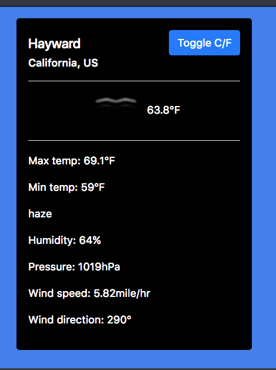

# My Portfolio
### A project work at GA Bootcamp
#### Link to this project website
* https://bmanandhar.github.io/bijaya.github.io/

#### This project is being developed to meet requirements to graduate the WDI-49 at General Asemble, San Francisco (dt 10/29/2018 thru 02/05/2019). Instructors wanted the cohorts to create the individual portfolio on their own as far as possible. This policy is being stricly followed. 

### Features

* A header bar, static
* A static nav-bar contains navigation to different url's
* nav-bar to convert to hamburger for smaller devices
* About me section contains text only
* Body content scrolls
* flex-box model adopted
* Minified jQuery used
* JavaScript used for DOM modification
* CSS used for styling
* Bootstrap CDN for carousel
* Some demos on animation
* Use of 'this' keyword in javaScript/jQuery on image fading
* DOM manipulation using jQuery append method and javaScript 'for loop'
* Combined effect of css and jQuery mouseleave() method
* Change in the value css property on hover using jQuery
* Simple jQuery-Effects examples on animation

#### Other projects added to this:
* Weather App: https://codepen.io/bmanandhar/pen/yvbyVL
* Random Quate: https://codepen.io/bmanandhar/pen/wyKJrY

Misc:
https://code.jquery.com/jquery-2.1.0.js
Slider-image
https://www.journaldev.com/4293/jquery-image-slider-css

### Technologies used:
* HTML5 including CSS and jQuery library
* Bootstrap library of Carousel class

### Research and helps

* w3 School {https://www.w3schools.com}
* Free Code Camp {https://medium.freecodecamp.org}
* YouTube {https://www.youtube.com/}
* Google {www.google.com}
* CodePen {https://codepen.io}
* GitHub {}
* https://www.sitepoint.com/guide-jquery-animate-method/

### Points yet unsolved
* Returning to original values of css after jQuery-Effects animation
* Form-validation
* Alignment of columns using Flex-box model
* Top section of the page yet to be fixed when mobile-menu is used
* footer element has not yet done properly

### Here are a few screenshot-images that reflect he works I did in preparing this project.
 

 

 

 
